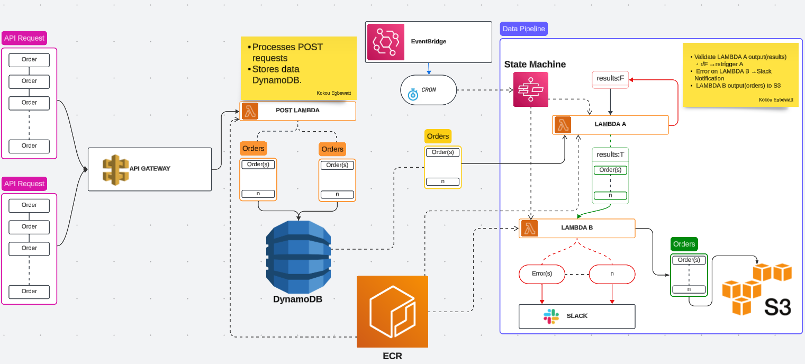

# Entrix Orders Challenge [](https://github.com/kinfinity/Entrix/actions/workflows/projects-build.yml) [](https://github.com/kinfinity/Entrix/actions/workflows/infrastructure-build.yml)

Our organization is participating in the energy market auction and has developed a service that generates and submits orders to the Auction Platform provider. The service, developed by Software Engineers and Data Scientists, accepts orders via an API and stores them in a database. Another service is responsible for submitting these orders to the Auction Platform. Additionally, Data Scientists have implemented logic for a Data Pipeline to retrieve and process results, storing them in an S3 bucket.

[**LAMBDAS**](https://github.com/entrixenergy/cloud-engineer-coding-challenge)

## **Architecture Overview**

# 

### **Directory Structure**

```
.
├── .github
│   └── workflows
├── assets
├── bin
├── ci
│   ├── configs
│   └── scripts
│           ├── code
│           └── infrastructure
├── lambda
│   ├── lambda_a
│   ├── lambda_b
│   └── post_lambda
├── lib
│   ├── compute
│   ├── constructs
│   ├── integration
│   ├── storage
└── tests
```

## **Code**

**Requirements**

<table><tbody><tr><td><code><strong>TOOL &nbsp;&nbsp;</strong></code></td><td><code><strong>VERSION &nbsp; &nbsp; &nbsp; &nbsp; &nbsp; &nbsp; &nbsp; &nbsp;&nbsp;</strong></code></td></tr><tr><td><code>Poetry&nbsp;</code></td><td><code>1.7.1 &nbsp; &nbsp; &nbsp; &nbsp; &nbsp; &nbsp; &nbsp; &nbsp; &nbsp;&nbsp;</code></td></tr><tr><td><code>Python&nbsp;</code></td><td><code>3.12.2 &nbsp; &nbsp; &nbsp; &nbsp; &nbsp; &nbsp; &nbsp; &nbsp; &nbsp;</code></td></tr><tr><td><code>CDK &nbsp; &nbsp;</code></td><td><code>2.129.0 (build d5ab0df)&nbsp;</code></td></tr><tr><td><code>Node &nbsp;&nbsp;</code></td><td><code>v20.11.1 &nbsp; &nbsp; &nbsp; &nbsp; &nbsp; &nbsp; &nbsp; &nbsp;</code></td></tr></tbody></table>

### **Enhancements**

- Order Schema and Validation `lambda/[LAMBDA_FUNCTION]/src/[LAMBDA_MODULE]/common/orders.py`

```python
orders = [OrderItem(**item) for item in input_dict.get("orders", [])]

class OrderItem(BaseModel):
    order_id: int
    product: str
    status: str
    power: int
```

- Lambda A
  - Read orders from DynamoDB if Random generated value for result is `True`

```python
def retrieve_items_from_dynamodb(table_name):

    try:
        # Retrieve the item
        response = dynamodb.scan(TableName=table_name)

        # Check if the item exists in the response
        if "Item" in response:
            return response["Item"]["orders"]
        return None

    except ClientError as e:
        print(f"Error: {e}")
        return None
```

- Lambda B
  - All accepted orders get aggregated and sent to S3
  - All rejected orders or errors to slack via SNS. ( Slack App integration not done)

```python
    rejected_orders = []
    try:
        accepted_orders = []
        if event["results"]:
            for order in event["orders"]:
                if order["status"] == "rejected":
                    print(f"{json.dumps(order)} Order status is rejected!")
                    rejected_orders.append(order)
                if order["status"] == "accepted":
                    print(f"{json.dumps(order)} Order status is accepted!")
                    accepted_orders.append(order)
        save_to_s3(
            data=accepted_orders,
            filename=f"orders/order_{dt.datetime.now(dt.timezone.utc).isoformat()}",
        )
        send_sns_notification(json.dumps(rejected_orders))
    except Exception as e:
        error_message = f"Key: {str(e)}"
        send_sns_notification(error_message)
        raise KeyError(error_message) from e
```

- Post Lambda
  - `validate_orders`
  - Save to DynamoDB

### **Build & Tests**

```
$ ci/scripts/code/build-all-poetry-projects.sh
```

### **Build & Push**

```
$ python3 ci/scripts/code/build-and-push-all-lambdas.py  --config ci/configs/pipeline-config.json --gitsha [GIT SHA] --registry [REGISTRY]
```

## **Infrastructure as Code**

IaC is setup with AWS CDK Typescript. simple constructs are built around `**compute [ lambda ]**`, `**integration [ sns, event bridge ]**` and `**storage [ dynamodb, s3 ]**` which are used to build more complex constructs for the `**apigateway w post lambda**` and `**state machine as data pipeline**`

- npm install
- aws configure

### **Deploy**

```
$ cdk deploy
```

### **Test**

- Setup env with infrastructure values deployed.
  - **export DYNAMODB_TABLE_NAME=""**
  - **export SNS_TOPIC_ARN=""**
  - **export LOG_BUCKET=""**

```
$ npm run test
```

### **CURL API Gateway**

Submit orders via the API Gateway using curl:

- Update the Orders to be sent within test.json in the ci/configs directory
- Get the API Gateway Endpoint Url from the Output on the Infrastructure Pipeline or the management console

```
$ ci/scripts/infrastructure/postapigateway.sh {API_GATEWAY_ENDPOINT}/api ci/configs/test.json
```

## **GIT Workflow & Pipelines**

**ENVIRONMENTS:**  \[ [https://github.com/kinfinity/Entrix/settings/environments](https://github.com/kinfinity/Entrix/settings/environments) \]

GitHub Environments are used and configured with AWS Account and Auth credentials to be able to work within each environments account as follows

- Dev
  - Triggered by PR into main branch
- Staging
  - Triggered by PR into main branch with tagged commit in the format `( v[0-9]*.[0-9]*.[0-9]* )`
  - Manual Approval by Reviewer
- Prod
  - Triggered by PR into main branch
  - Manual Approval by Reviewer
  - Tagged commit with successul Stagging Environment Deployment

```
$ git tag -a v1.0.0 -m "Version 1.0.0"

$ git push origin --tags
```

**PIPELINES:**

GHA is used for the pipelines via source `./github/workflows` for both our lambda function code then Docker Image Builds and Infrastructure Builds and Deployments\[ [https://github.com/kinfinity/Entrix/actions/workflows/projects-build.yml,](https://github.com/kinfinity/Entrix/actions/workflows/projects-build.yml,) [https://github.com/kinfinity/Entrix/actions/workflows/infrastructure-build.yml](https://github.com/kinfinity/Entrix/actions/workflows/projects-build.yml) \]

## **Future Enhancements**

- Implement revised tagging and release strategy.
- Image build and push pipeline succesful completion sends tag updates to Infrastructure pipeline and redeploys Lambdas

## **Conclusion**

Follow the outlined steps to deploy the infrastructure for the energy market auction service using **aws-cdk**. This infrastructure will ensure efficient order processing, data retrieval, and storage in AWS services
